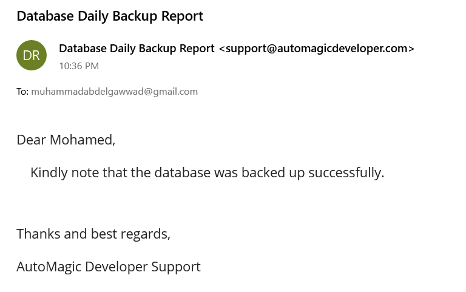
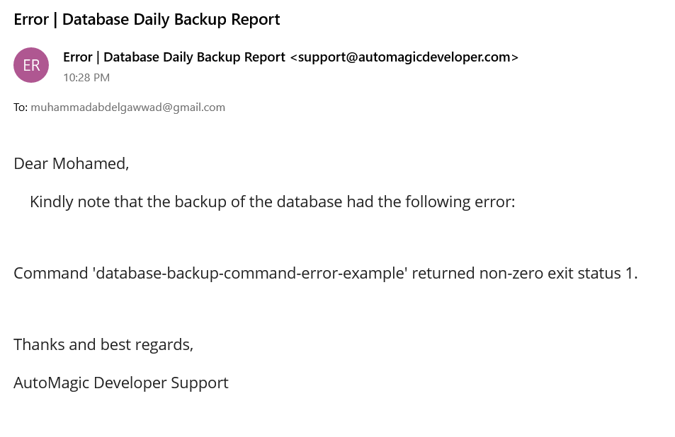
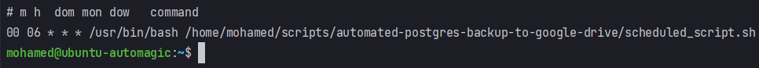

<!-- PROJECT SHIELDS -->
<!--
*** I'm using markdown "reference style" links for readability.
*** Reference links are enclosed in brackets [ ] instead of parentheses ( ).
*** See the bottom of this document for the declaration of the reference variables
*** for contributors-url, forks-url, etc. This is an optional, concise syntax you may use.
*** https://www.markdownguide.org/basic-syntax/#reference-style-links
-->

<a name="readme-top"></a>

[![LinkedIn][linkedin-shield]][linkedin-url]


<!-- PROJECT LOGO -->
<br />
<div align="center">
    

  <h3 align="center">Automated PostgreSQL Database Backup To Google Drive</h3>

</div>


<!-- TABLE OF CONTENTS -->
<details>
  <summary>Table of Contents</summary>
  <ol>
    <li>
      <a href="#about-the-project">About The Project</a>
      <ul>
        <li><a href="#built-with">Built With</a></li>
      </ul>
    </li>
    <li>
      <a href="#getting-started">Getting Started</a>
      <ul>
        <li><a href="#libraries">Libraries</a></li>
        <li><a href="#packages">Packages</a></li>
        <li><a href="#service-accounts">Service Accounts</a></li>
        <li><a href="#known-exceptions">Known Exceptions</a></li>
      </ul>
    </li>
    <li><a href="#roadmap">Roadmap</a></li>
    <li><a href="#license">License</a></li>
    <li><a href="#contact">Contact</a></li>
  </ol>
</details>


<!-- ABOUT THE PROJECT -->
## About The Project

![product-screenshot]

* Project Name: automated-postgres-backup-to-google-drive
* Version: v1.0

### Description

I started running a self-managed PostgreSQL database for my website. Not so much later, I realized that I need to backup my database regularly to avoid any loss in the content that I am creating. So, here is what i did:

* I searched for a linux command to backup the database, and I figured it out eventually. The below command dumps a backup file of the database in plain text format:
```sh
  PGPASSWORD="Database_User_Password" pg_dump -h localhost -U Database_Username -F p Database_Name > Output_File_Name.sql
```
* I also figured out a couple of commands that are useful too:
```sh
  # Delete a Database:
  sudo su - postgres -c "dropdb test"
```
```sh
  # Create a Database:
  sudo su - postgres -c "createdb test"
```
```sh
  # Restore a database backup
  sudo su - postgres -c psql test < automagicdeveloper_db__13_01_2023_06_35_03.sql
```

* I developed a Python package to integrate with Google Drive to store my database's backups:
```sh
  https://github.com/m-abdelgawad/google-drive-integration
```

* I developed this project in Python to dump a backup file of my database then upload it to my Google Drive folder.

* I developed a Python package to send email report to confirm that the backup completed successfully or to send any errors that were encountered.
```sh
  https://github.com/m-abdelgawad/send-mail-with-smtp-python-package
```
#### Successful Email Report:


#### Unsuccessful Email Report:


* Created a bash script to activate the virtual environment and execute the project:
```sh
  #!/bin/bash
  cd /home/mohamed/scripts/automated-postgres-backup-to-google-drive
  pwd
  . venv/bin/activate
  python automated_postgres_backup_to_google_drive/
```

* Finally, I scheduled the previous script to run daily on my server in the Crontab.
```sh
  00 06 * * * /usr/bin/bash /home/mohamed/scripts/automated-postgres-backup-to-google-drive/scheduled_script.sh
```



<p align="right">(<a href="#readme-top">back to top</a>)</p>


### Built With

This project was developed using the following tech stacks:

* Python
* Bash

<p align="right">(<a href="#readme-top">back to top</a>)</p>


<!-- GETTING STARTED -->
## Getting Started

In this section, I will give you instructions on setting up this project locally.
To get a local copy up and running follow these simple steps.

### Libraries

* pip
  
  ```sh
  pip install PyYAML==6.0
  ```
  ```sh
  pip install google-auth==2.16.0
  ```
  ```sh
  pip install google-api-python-client==2.72.0
  ```
  
### Packages
* GoogleDrive (check it at: https://github.com/m-abdelgawad/google-drive-integration)

### Service Accounts
* Service Account on Google Cloud that can access your Google Drive Folder

### Known Exceptions
* None

<p align="right">(<a href="#readme-top">back to top</a>)</p>


<!-- ROADMAP -->
## Roadmap

- [x] Backup the PostgreSQL database.
- [x] Upload the backup file to Google Drive.
- [x] Schedule the project to run daily in the Crontab.
- [x] Send a backup by mail to confirm that the backup was completed successfully or send any errors that has occured.

<p align="right">(<a href="#readme-top">back to top</a>)</p>

<!-- LICENSE -->
## License

Distributed under the MIT License. See `LICENSE.txt` for more information.

<p align="right">(<a href="#readme-top">back to top</a>)</p>


<!-- CONTACT -->
## Contact

Mohamed AbdelGawad Ibrahim - [@m-abdelgawad](https://www.linkedin.com/in/m-abdelgawad/) - +201069052620 - muhammadabdelgawwad@gmail.com

Github Profile Link: [https://github.com/m-abdelgawad](https://github.com/m-abdelgawad)

<p align="right">(<a href="#readme-top">back to top</a>)</p>


<!-- MARKDOWN LINKS & IMAGES -->
<!-- https://www.markdownguide.org/basic-syntax/#reference-style-links -->
[linkedin-shield]: https://img.shields.io/badge/-LinkedIn-black.svg?style=for-the-badge&logo=linkedin&colorB=555
[linkedin-url]: https://www.linkedin.com/in/m-abdelgawad/
[product-screenshot]: images/screenshot.png
